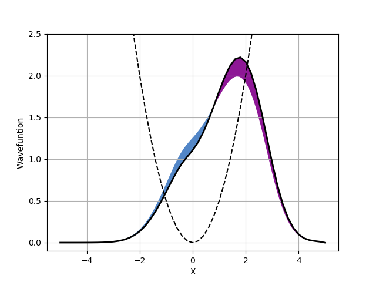

# Quantum Draw

Can you beat a network at quantum mechanics ?

## Introduction

This the (atm) the backend of thr project. It allows to use RBF-NN to solve 1D quantum problems and also give tools to process the solution drawned by the users

## Example : User wave function

```python
import torch
import numpy as np

from quantumdraw.sampler.metropolis import  Metropolis
from quantumdraw.wavefunction.user_wave_function import UserWaveFunction
from quantumdraw.solver.user_solver import UserSolver
from quantumdraw.solver.plot_utils import plot_wf_1d

def pot_func(pos):
    '''Potential function desired.'''
    return  0.5*pos**2

def gen_pts(pos):
    '''Small function that simulate the users'''
    return torch.exp(-0.5*pos**2) + 2*torch.exp(-0.75*(pos-2.)**2)

# box
domain, ncenter = {'xmin':-5.,'xmax':5.}, 11

# create the x,y pts that users "draw"
# should be replaced by the real drawing
xpts = torch.tensor(np.sort(np.random.rand(25)*10-5))
ypts = gen_pts(xpts).detach().numpy()
xpts = xpts.detach().numpy()

#user wave function
uwf = UserWaveFunction(pot_func,domain,xpts=xpts,ypts=ypts)

#sampler
sampler = Metropolis(nwalkers=100, nstep=100, 
                     step_size = 0.5, domain = domain)

# solver
usolver = UserSolver(wf=uwf,sampler=sampler)

#example of what the UI could look like
plot_wf_1d(usolver,domain,51,feedback=usolver.feedback())

# get the energy/variance of the user wave function
pos,e,v = usolver.single_point()

# get the score of the user
score = usolver.get_score()
``` 

<p align="center">

</p>


## Example : Neural wave function

```python
import torch
from torch import optim
import numpy as np

from quantumdraw.sampler.metropolis import  Metropolis
from quantumdraw.wavefunction.neural_wave_function import NeuralWaveFunction
from quantumdraw.solver.neural_solver import NeuralSolver
from quantumdraw.solver.plot_utils import plot_results_1d, plotter1d

#sampler
sampler = Metropolis(nwalkers=1000, nstep=2000, 
                     step_size = 0.5, domain = domain)

# wavefunction
wf = NeuralWaveFunction(pot_func,domain,ncenter,fcinit='random',sigma=0.5)

# optimizer
opt = optim.Adam(wf.parameters(),lr=0.05)

# scheduler
scheduler = optim.lr_scheduler.StepLR(opt,step_size=100,gamma=0.75)

# define solver
solver = NeuralSolver(wf=wf,sampler=sampler,optimizer=opt,scheduler=scheduler)

# train the wave function
plotter = plotter1d(wf,domain,100,sol=ho1d_sol)
solver.run(300,loss = 'variance', plot = plotter,save='model.pth' )

# plot the final wave function 
plot_results_1d(solver,domain,100,ho1d_sol,e0=0.5,load='model.pth')
```

# Setup
Use python 3.7 virtual env
- `pip install numpy cython`
- `pip install -r requirements.txt`
- `pip install -e .`
- `python quantumdraw/server/server.py`
- open browser on `http://localhost:8888`

